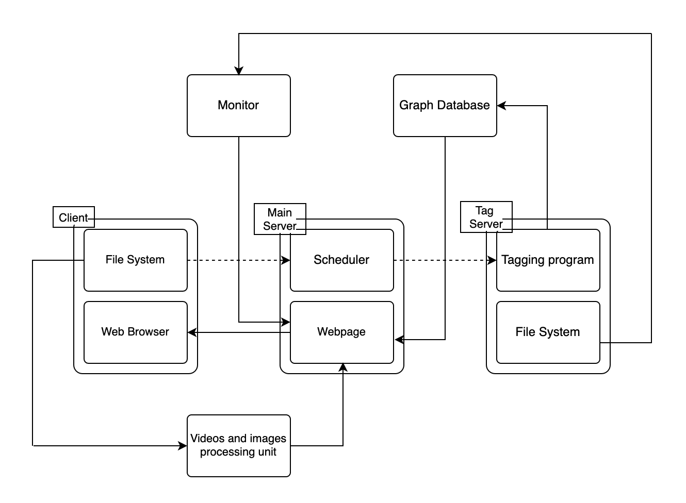

# x-WowKiddy

This is the course project of the Operating Systems (H), USTC, made by group x-WowKiddy.

## Group Members

* Cheng Ding
* Jinghan Ke
* Jun Wu
* Tengyue Wang
* Feng Yu

## Project Summary

This project aim to create a distributed dataset platform for shared images and videos. We constructed the  system based on an open-source distributed file system JuiceFS. We extract the information from images and videos, storage them into a graph database, which allows users to view connection of files, as well as previewing images and videos online. Besides, some open-source tools like Prometheus and Grafana are used to monitor the system. Docker Compose is used to deploy the system.

## Repo Description

* code : codes in the process of development
* docs : some reports, ppts, papers and documents
* package : the whole, final project
* src : some images used in docs

## Structure

The image below can best illustrate the structure of the system :

The system contains several modules: 

* the main server, to schedule the whole system and communicate between modules.
* the tag server, to extract information from the images and videos in the file system, put them to the graph database
* the client, user can launch the client, mount the file system, and view the images and videos in Browser
* the monitor, launched at the tag server, to get the information of the file system and visualize them
* the graph database, storage the metainfo and tags extracted from the images and videos
* the processing unit, to process videos and images, make them easy to be preview online

## Tools

introduce some tools used in the system

* [JuiceFS](https://github.com/juicedata/juicefs) : **JuiceFS** is a high-performance [POSIX](https://en.wikipedia.org/wiki/POSIX) file system released under Apache License 2.0, particularly designed for the cloud-native environment.

  In this system, we use juicefs as the fundamental distributed system, on account of its reliability

* [Neo4j](https://github.com/neo4j/neo4j) : **Neo4j** is the world’s leading Graph Database. It is a high performance graph store with all the features expected of a mature and robust database, like a friendly query language and ACID transactions.

  In this system, we use Neo4j to storage the metainfo and tags of images/videos, because it could present the connection and relationship among files.

* [Prometheus](https://github.com/prometheus/prometheus) and [Grafana](https://github.com/grafana/grafana) : **Prometheus**, a [Cloud Native Computing Foundation](https://cncf.io/) project, is a systems and service monitoring system. It collects metrics from configured targets at given intervals, evaluates rule expressions, displays the results, and can trigger alerts when specified conditions are observed.

​		**Grafana** is the open-source platform for monitoring and observability, it allows you to query, visualize, 		alert on and understand your metrics no matter where they are stored. 

​		In this system, we use Prometheus and Grafana to build a monitor of the file system.

* [Docker Compose](https://github.com/docker/compose) : **Docker Compose** is a tool for running multi-container applications on Docker defined using the [Compose file format](https://compose-spec.io/). 

​		In this system, we use Docker Compose to deploy the system in the server. Its sandbox environment 		avoids the problems caused by the server's primitive environment.

## Note

This system is just a course project made by a group of junior grade undergraduates. Thus it is a demo of the distributed dataset platform for shared images and videos. It could present the basic function as shown above, however, something unreliable might included in the system. We may reconstruct the system in the future, if you're interested in the project or have some problems about it, feel free to propose issues.
