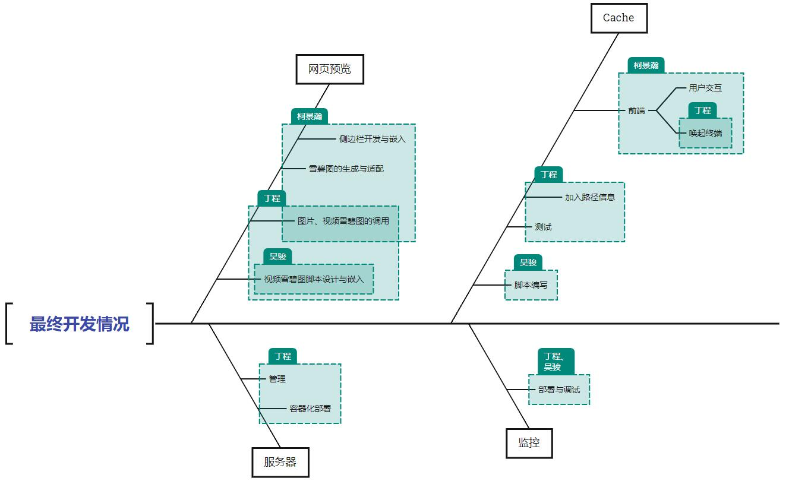
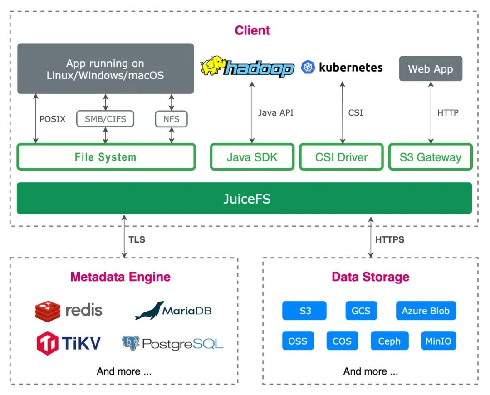
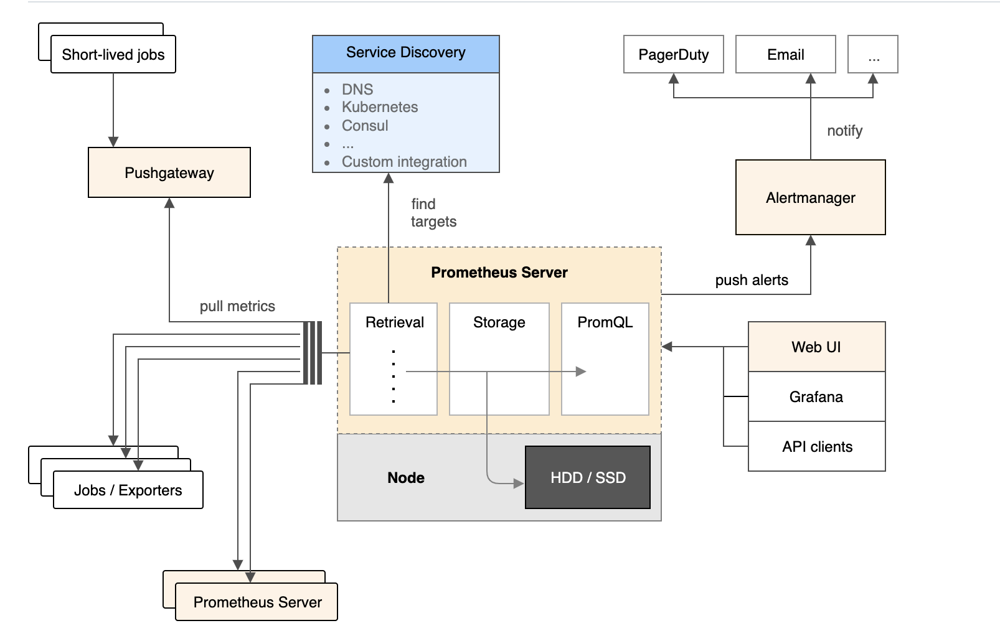
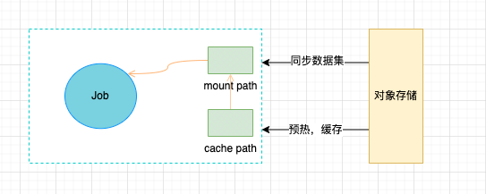
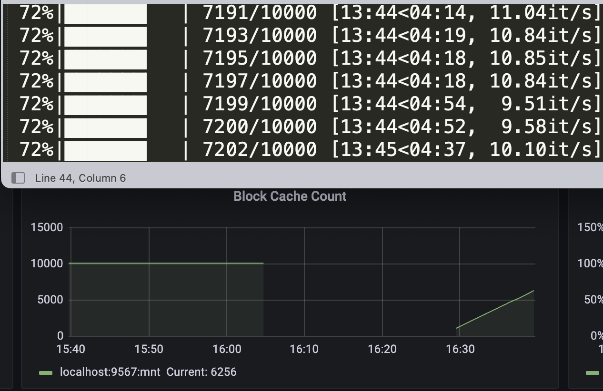
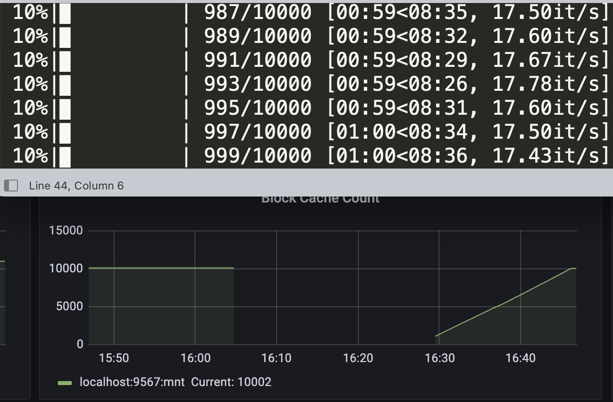
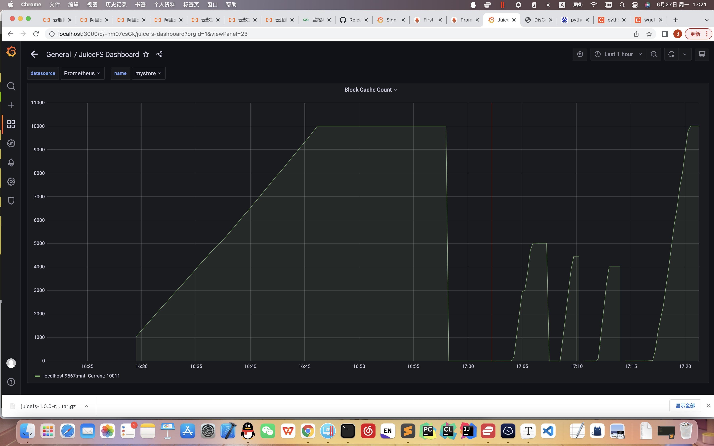
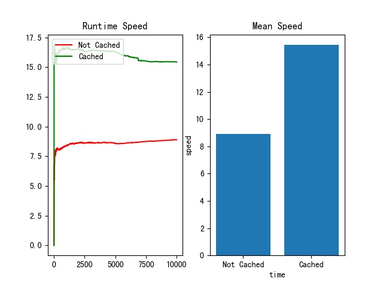
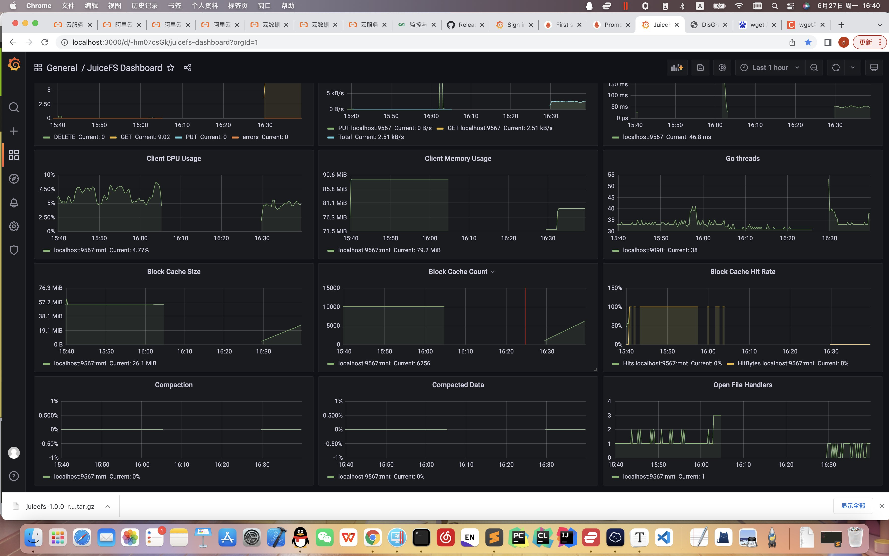

# 终期报告

---

## 项目介绍

现有的热门的分布式文件系统，如`Juicefs`，有着许多性能与用户体验上的问题。特别在目前火热的深度学习等需要昂贵硬件资源的领域，一个大容量，高读写速度的分布式文件系统显得尤为重要。在本次项目中，我们选取了DisGraFs这一项目，从不同方面针对现有的分布式文件系统的瓶颈与用户体验进行了优化与改造。我们实现了：

- 容器化封装与部署，简化了项目的部署过程，并且提高系统的隔离性与鲁棒性，让项目更加工程化。
- 主动缓存逻辑cache，不选用`Juicefs`等分布式文件系统传统的顺序cache方式，利用图文件系统中文件的逻辑性关联实现主动缓存机制，极大加速了相同逻辑关联的文件的访问。同时还支持主动缓存整个数据集，极大提高文件系统的读写速度。有利于在深度领域参与构建AI模型的训练数据集，并与筛选与处理平台或训练平台进行对接。
- 网页预览与UI的优化，为了加强用户体验与分布式文件系统查看文件的便捷性，我们在前端嵌入了图片的预览与视频的雪碧图生成与预览，同时优化了原有的前端效果，在保证性能的同时给用户创造了良好的使用环境。
- 监控，为了监控我们实现的cache性能与系统在读取过程中cache的增长替换等过程，我们搭建了监控该分布式文件系统的监控组件，实现实时监控文件系统的状况与性能——如缓存大小与速率，资源使用量等。

## 项目意义

在当今大数据时代，由于数据规模的逐步增长，对数据集的本地存储越来越不能适应巨大的数据规模，因此对分布式数据集的构建以及分布式模型的训练的需求越发迫切，对此，我们的项目提供了一个构建共享分布式数据集的平台，

在前端方面，我们支持了图片及视频的在线预览，可以使得用户无需下载文件即可低开销地预览，同时支持了对特定标签的文件的主动缓存，使得机器学习模型在读取分布式数据集时的速度得到了极大提升。

在部署方面，使用容器化技术简化部署流程，同时增强了运行环境的隔离性和鲁棒性。同时使用监控部件检测分布式系统的各类指标，以便运维人员对平台进行维护。

总体来说，我们项目放眼未来，针对大规模数据的场景进行了设计和实现，同时兼顾了用户以及运维人员的体验，为以后的分布式数据集平台提供了一个可靠的参考。

## 小组成员分工

### 前期工作

柯景瀚：调研vGPU，调研分布式一致性，提出高速缓存并调研，提出网页预览并调研，提出监控与测试方式，讨论高速缓存技术路线。

余丰：提出分布式GPU，调研vGPU，讨论高速缓存技术路线。

王腾岳：取了一个非常棒的组名WowKiddy，调研网页预览并尝试开发出一个demo。

丁程：将DisGraFS部署出来，提出容器化部署并调研，敲定高速缓存测试方式，讨论高速缓存技术路线。

吴骏：调研一致性算法Paxos，调研数据追加型增删改的优势及嵌入开发必要性，讨论高速缓存技术路线。

### 开发工作

### 辅助工作

## 立项依据

### 分布式文件系统：Juicefs

JuiceFS 是一款面向云环境设计的高性能共享文件系统，在 AGPL v3.0 开源协议下发布。提供完备的 [POSIX](https://en.wikipedia.org/wiki/POSIX) 兼容性，可将海量低价的云存储作为本地磁盘使用，亦可同时被多台主机同时挂载读写。

使用 JuiceFS 存储数据，数据本身会被持久化在对象存储（例如，Amazon S3），而数据所对应的元数据可以根据场景需要被持久化在 Redis、MySQL、SQLite 等多种数据库中。

JuiceFS 提供了丰富的 API，可以在不修改代码的前提下无缝对接已投入生产的大数据、机器学习、人工智能等应用平台，为其提供海量、弹性、低价的高性能存储。

由于其对高速缓存以及一致性方面的支持，本项目使用juicefs作为底层的分布式文件系统，在其基础上搭建起整个项目。

### 浏览器与本地脚本交互：ActiveX

ActiveX是[Microsoft](https://baike.baidu.com/item/Microsoft/125917)对于一系列策略性[面向对象程序](https://baike.baidu.com/item/面向对象程序/8359543)技术和工具的称呼，其中主要的技术是[组件对象模型](https://baike.baidu.com/item/组件对象模型/3351546)（COM）。在有目录和其它支持的网络中，COM变成了分布式COM（DCOM)。

ActiveX 控件是用于互联网的很小的程序，有时称为[插件程序](https://baike.baidu.com/item/插件程序/5704926)*。*它们会允许播放动画，或帮助执行任务，如在 Microsoft Update 安装安全更新，因此可以增强用户的浏览体验。

在创建包括ActiveX程序时，主要的工作就是组件，一个可以自足的在ActiveX网络（Windows，Mac，Linux）中任意运行的程序。这个组件就是ActiveX控件。ActiveX是Microsoft为抗衡Sun Microsystems的JAVA技术而提出的，此控件的功能和java applet功能类似。

本项目通过ActiveX调用主动缓存脚本。

### 监控：Prometheus Server和Grafana

Prometheus：Prometheus是一个开源的系统监控和警报工具包。自2012年启动以来，许多公司和组织都采用了Prometheus，该项目拥有非常活跃的开发人员和用户社区。它现在是一个独立的开源项目，独立于任何公司进行维护。Prometheus于2016年加入云原生计算基金会，成为继Kubernetes之后的第二个托管项目。

它具有下列特性：

- 一个多维数据模型，包含由指标名称和键/值对（Tag）标识的时间序列数据
- PromQL是一种灵活的查询语音，用于查询并利用这些维度数据
- 不依赖分布式存储，单个服务器节点是自治的
- 时间序列收集是通过HTTP上的pull模型进行的（支持Pull）
- 推送时间序列是通过一个中间网关来支持的（也支持Push）
- 目标是通过服务发现或静态配置发现的
- 多种模式的图形和仪表盘支持

总结一下，就是多维数据模型、PromQL查询语言、节点自治、HTTP主动拉取或者网关主动推送的方式获取时间序列数据、自动发现目标、多种仪表盘支持。

总体架构如下所示：

Grafana:

Grafana是一个开源的，拥有丰富dashboard和图表编辑的指标分析平台，和Kibana不同的是Grafana专注于时序类图表分析，而且支持多种数据源，如Graphite、InfluxDB、Elasticsearch、Mysql、K8s、Zabbix等。

本项目使用Prometheus+Grafana构建了对分布式系统的监控组件。

### 视频预览雪碧图生成：ffmpeg

FFmpeg是一套可以用来记录、转换数字音频、视频，并能将其转化为流的开源计算机程序。采用LGPL或[GPL](https://baike.baidu.com/item/GPL/2357903)许可证。它提供了录制、转换以及流化音视频的完整解决方案。它包含了非常先进的音频/视频编解码库libavcodec，为了保证高可移植性和编解码质量，libavcodec里很多code都是从头开发的。

**精灵图**（英语：Sprite），又被称为**拼合图**。在[计算机图形学](https://zh.wikipedia.org/wiki/计算机图形学)中，当一张[二维](https://zh.wikipedia.org/wiki/二維)[图像](https://zh.wikipedia.org/wiki/图像)集成进场景中，成为整个显示图像的一部分时，这张图就称为**精灵图**。

因为常见碳酸饮料[雪碧](https://zh.wikipedia.org/wiki/雪碧)的英文名称也是“Sprite”，也有人会使用**雪碧图**的非正式译名。

本项目使用ffmpeg进行视频的切分，以便于网页预览。

### 容器化部署：Docker Compose

`Docker Compose`是Docker编排服务的一部分，Compose可以让用户在集群中部署分布式应用。`Docker Compose`是一个属于“应用层”的服务，用户可以定义哪个容器组运行哪个应用，它支持动态改变应用，并在需要时扩展。

本项目对服务器端的代码进行了容器化封装。

## 技术路线与对应成果

### 容器化封装与部署

- 使用 Dockerfile 定义应用程序的环境。
- 使用 docker-compose.yml 定义构成应用程序的服务，这样它们可以在隔离环境中一起运行。
- 最后，执行 docker-compose up 命令来启动并运行整个应用程序。

根据上述步骤对neo4j服务器和索引服务器进行打包封装。

### 主动缓存逻辑cache

当用户在网页前端搜索文件时，点击`warmup`按钮之后浏览器会根据tag的信息保存，利用`Activex`调用本地脚本与neo4j服务器进行通信，通过查询neo4j数据库得到这一tag所有相关文件的地址信息。之后调用juicefs的接口实现主动缓存的功能。当缓存超过预设置的数值大小之后，会采用类LRU算法进行cache块的替换。

在测试中，我们选用了MNIST数据集，读取并使用PIL处理文件，在没有预先缓存的情况下，我们可以得到如下数据：

通过我们搭载的监控系统可以清晰的看到一开始的cache总量为0，随着测试的进行cache的总量逐渐增大。当cache填满之后读取速度极大的增加：

当我们使用了主动缓存的时候，从最后那根陡峭的曲线可以看出缓存的速度极大的提升：

之后我们对两种不同的情况进行总体的速度测量，得到对比图如下所示：

主动缓存之后的速度相比未缓存时提升将近一倍，这对于机器学习模型的分布式训练速度的提升有极大的意义。

### 网页预览与UI的优化

当用户上传视频时，我们内嵌的watchdog脚本会检测到这一变化，同时根据文件的元信息来作出判断。如果是视频文件则调用`ffmpeg`切割生成雪碧图。在前端我们利用了js脚本和css样式来加上预览的侧边栏，通过popoto.js来得到node的信息，判断节点类型来显示预览（图片根据设置好的大小直接预览，视频则根据生成的雪碧图来进行预览）。展示的视频附在ppt中。

### 监控

为了检测我们基于逻辑的主动cache的性能和使用JuiceFS过程中cache等相关指标的变化情况，我们搭载了监控系统来衡量我们整个系统的性能。同时，作为承载海量数据存储的分布式文件系统，用户通常需要直观地了解整个系统的容量、文件数量、CPU 负载、磁盘 IO、缓存等指标的变化。`JuiceFS`默认通过http://localhost:9567/metrics可以输出客户端的实时监控数据，我们通过搭建`Prometheus Server`来获取并处理这些数据，再将处理好的数据发送给`Grafana`，实现可视化监控的目的。

## 效果展示

见ppt中视频展示。