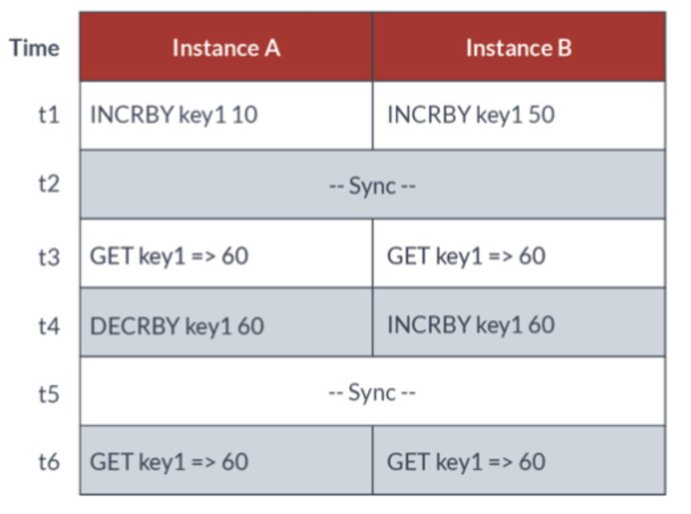
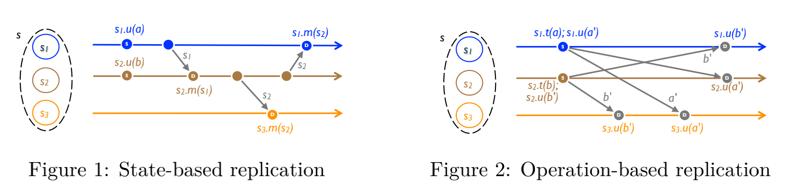
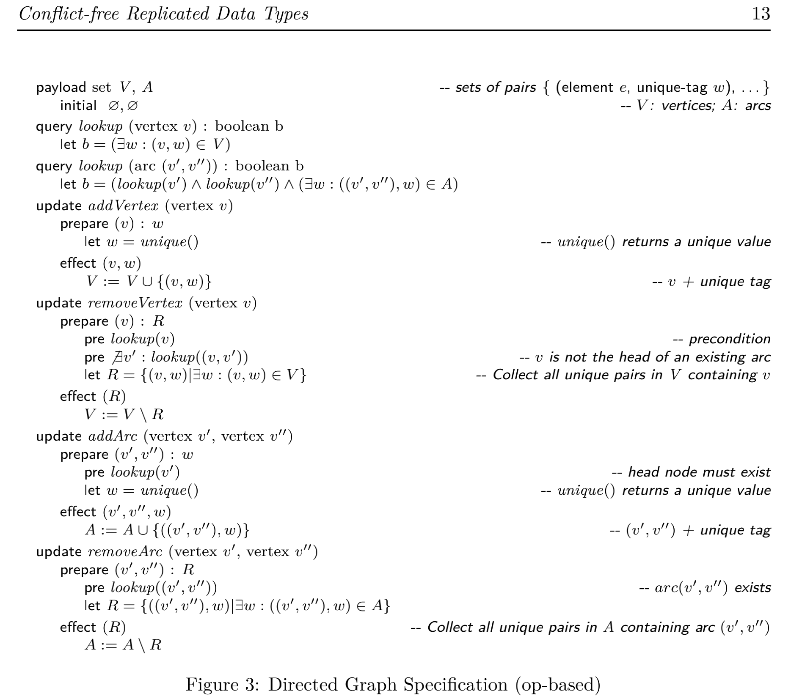

# CRDT 调研报告

## 1.What is CRDT

​	CRDT，全称无冲突复制数据类型(Conflict-free Replicated Data Type)，在具体阐述之前，先简要介绍一下分布式系统的CAP理论。

### 1.1 CAP Theory

​	强一致性(Consistency)： 即在分布式系统中的同一数据多副本情形下， 对千数据的更新操作体现出的效果与只有单份数据是一样的。

​	可用性(Availability)： 客户端在任何时刻对大规模数据系统的读／写操作都应该保证在限定延时内完成。

​	分区容忍性(Partition Tolerance)： 在大规模分布式数据系统中， 网络分区现象， 即分区间的机器无法进行网络通信的情况是必然会发生的， 所以系统应该能够在这种情况下仍然继续工作。

​	CAP 最初是由Eric Brewer于1999 年首先提出的， 他同时证明了：**对于一个大规模分布式数据系统来说， CAP 三要素不可兼得**， 同一个系统至多只能实现其中的两个， 而必须放宽第3 个要素来保证其他两个要素被满足。

### 1.2 CRDT的提出

​	于2012年，CAP理论的创始者在*computer*杂志上刊载了一篇文章，指出了当时学界及业界对于CAP理论的误区：CAP理论并不是为了P（分区容忍性），要在A和C之间选择一个。事实上，分区很少出现，CAP在大多数时候允许完美的C和A。但当分区存在或可感知其影响的情况下，就要预备一种策略去探知分区并显式处理其影响。这样的策略应分为三个步骤：探知分区发生，进入显式的分区模式以限制某些操作，启动恢复过程以恢复数据一致性并补偿分区期间发生的错误。

​	CRDT应运而生，其最初提出的动机是因为最终一致性，即随时保持可用性，但是各个节点会存在不一致的时刻。论文 *Conflict-free replicated data types*提出了简单的、理论证明的方式来达到最终一致性。

​	CRDT 不提供「完美的一致性」，它提供了**强最终一致性(Strong Eventual Consistency)**，这代表进程A可能无法立即反映进程B上发生的状态变动，但是当A、B同步消息之后他们二者就可以恢复一致性，并且不需要解决潜在冲突（CRDT在数学上杜绝了冲突发生的可能性）。而「强最终一致性」是不与「可用性」和「分区容错性」冲突的，所以CRDT同时提供了这三者，达成了较好的CAP上的权衡。

### 1.3 CRDT原理

CRDT有两种类型：Op-based CRDT和State-based CRDT。下面分别介绍两种CRDT的设计思路。

#### 1.3.1 Op-based CRDT

​	顾名思义，Op-based CRDT是基于用户的操作序列的。如果两个用户的操作序列完全一致，则最终文档的状态也一定是一致的。所以这种方法让各个用户保存对数据的所有操作，用户之间通过同步Operations来达到最终一致状态。但如何保证Operation的顺序是一致的呢？如果有并行的修改操作应该如何分辨先后？为了解决这种问题，Op-based CRDT要求所有可能并行的操作都是可交换的，从数据类型和Operation的层面杜绝了因操作先后顺序而导致的不一致性。

#### 1.3.2 State-based CRDT

​	当可能并行的操作不满足可交换时，则可以考虑同步副本数据，同时附带额外的元信息协同副本的合并。让元信息满足条件的方式是让其更新保持单调，这个关系一般被称为偏序关系。例如，让每个更新操作都带上当时的时间戳，在合并时对比本地副本时间戳及同步副本时间戳，取更新的结果，这样总能保证结果最新且最终一致。

### 1.4 A simple example

G计数器是CRDT的一个简单的例子，其中的元素满足 $a+b=b+a$ 和  $ a+(b+c) = (a+b)+c $ .副本仅彼此交换更新。CRDT将通过合并更新来merge。

## 2.Related Work

​	介绍基于CRDT构建的一些框架及一些相关文献，可供参考。

* [Yjs](https://link.zhihu.com/?target=https%3A//github.com/yjs/yjs) （基于JavaScript）

* [y-crdt](https://link.zhihu.com/?target=https%3A//github.com/yjs/y-crdt) （Yjs的rust实现）

* [Automerge](https://link.zhihu.com/?target=https%3A//github.com/automerge/automerge)

* [Delta-CRDT](https://github.com/peer-base/js-delta-crdts)

* [Diamond-type](https://link.zhihu.com/?target=https%3A//github.com/josephg/diamond-types)

项目 [https://github.com/dmonad/crdt-benchmarks] 中列出了前三者的benchmark，大致结果为Yjs性能最佳。

* [Conflict-free replicated data types](https://link.zhihu.com/?target=https%3A//readpaper.com/paper/1516319412) CRDT原论文

* [Near Real-Time Peer-to-Peer Shared Editing on Extensible Data Types](https://www.researchgate.net/publication/310212186_Near_Real-Time_Peer-to-Peer_Shared_Editing_on_Extensible_Data_Types)  Yjs论文

* [A Conflict-Free Replicated JSON Datatype](https://link.zhihu.com/?target=https%3A//arxiv.org/abs/1608.03960) Automerge论文

* [CRDTs The Hard Parts](https://link.zhihu.com/?target=https%3A//martin.kleppmann.com/2020/07/06/crdt-hard-parts-hydra.html)  Automerge作者的另一篇文章

* [5000x faster CRDTs: An Adventure in Optimization](https://link.zhihu.com/?target=https%3A//josephg.com/blog/crdts-go-brrr/)  Diamond-Type作者的文章

### 3.24更新 CRDT原论文摘录

​	如图1所示，state-based replication在执行更新在执行会修改单个复制副本的状态。每个副本会定时将其本地状态发送给其他副本，后者会合并该状态。这样，每次更新直接或间接地最终都会到达每个副本。

​	Op-based replication种没有merge操作，并且将update操作分成了t和u两种操作。t是pre-update，u是effect-update。pre-update在产生更新的单个副本上进行，同时，在该副本（源副本）上，effect-update会在pre-update执行完之后立即执行。effect-update在所有副本（下游副本）上执行。源副本使用指定的通信协议将effect-update传递给下游副本。

​	在论文中，作者还提出了如何构建一个op-based Directed-Graph-CRDT。而DisGraFS正是基于图数据库做成的。或许我们可以运用图结构的CRDT去解决其强一致性问题。

