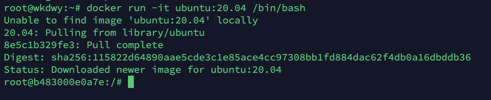
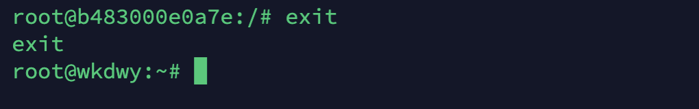
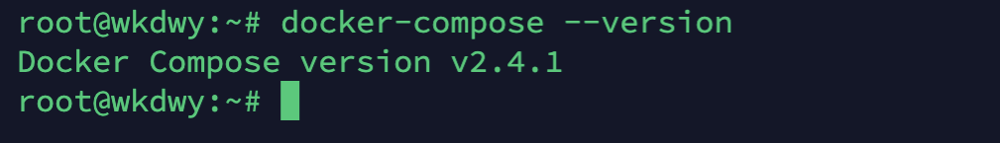
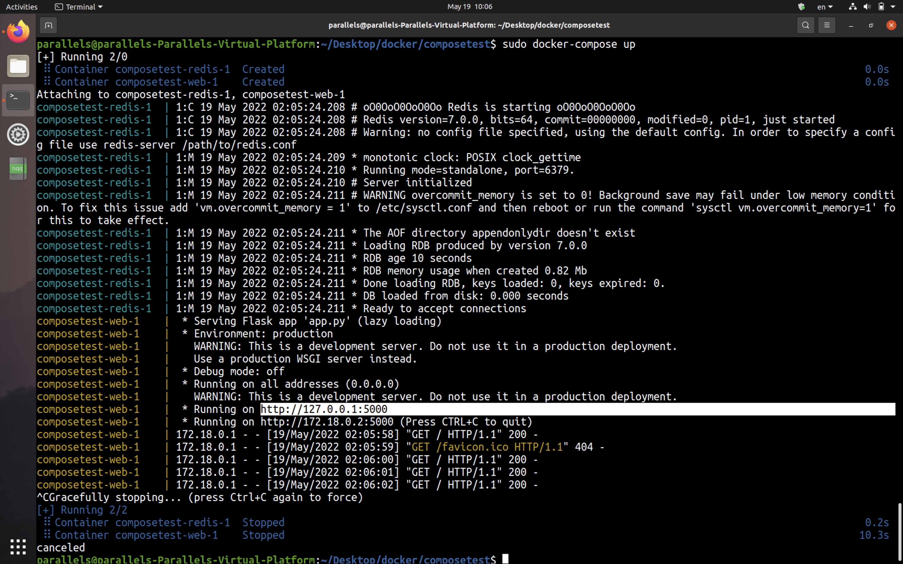

# Docker及Docker Compose配置文档

本文档记录服务器端Docker以及Docker Compose安装以及配置的过程

## 1. Docker安装及配置

### 1.1 Docker安装

以Ubuntu为例

使用如下命令一键安装Docker

```
curl -sSL https://get.daocloud.io/docker | sh
```


### 1.2 Docker测试

在终端运行如下命令测试docker:

```
docker run ubuntu:20.04 /bin/echo "Hello World!"
```

预期在命令行打印出：

```
Hello World！
```


使用如下命令可以创建一个交互式的容器，即拥有终端的可对话的容器：

```
docker run -it ubuntu:20.04 /bin/bash
```

预期出现如下界面：



使用exit命令可以退出容器终端：




### 1.3 Docker相关配置

--Docker镜像加速

使用命令：

```
sudo vim /etc/docker/daemon.json
```

在打开的文件中加入如下内容：

```
{
  "registry-mirrors": [
    "https://reg-mirror.qiniu.com"
  ],
  "exec-opts": [ "native.cgroupdriver=systemd" ]
}
```

输入:wq保存并退出

之后使用如下命令重新启动Docker服务：

```
sudo systemctl daemon-reload
sudo systemctl restart docker
```


## 2. Docker Compose安装及配置

### 2.1 Docker Compose安装

使用如下命令安装Docker Compose：

```
curl -L https://get.daocloud.io/docker/compose/releases/download/v2.4.1/docker-compose-`uname -s`-`uname -m` > /usr/local/bin/docker-compose
```

安装完成后，使用如下命令赋予相关文件可执行权限并创建软链接：

```
sudo chmod +x /usr/local/bin/docker-compose
sudo ln -s /usr/local/bin/docker-compose /usr/bin/docker-compose
```

测试是否安装成功：

```
docker-compose --version
```

预期出现如下界面：



代表安装成功


### 2.2 Docker Compose测试

#### 2.2.1 创建测试目录

```
mkdir composetest
cd composetest
```

#### 2.2.2 创建测试文件

在测试目录中创建名为app.py的python文件，将如下内容复制到该python文件中：

```
import time

import redis
from flask import Flask

app = Flask(__name__)
cache = redis.Redis(host='redis', port=6379)


def get_hit_count():
  retries = 5
  while True:
    try:
      return cache.incr('hits')
    except redis.exceptions.ConnectionError as exc:
      if retries == 0:
        raise exc
      retries -= 1
      time.sleep(0.5)


@app.route('/')
def hello():
  count = get_hit_count()
  return 'Hello World! I have been seen {} times.\n'.format(count)
```

在此示例中，redis 是应用程序网络上的 redis 容器的主机名，该主机使用的端口为 6379。

在 composetest 目录中创建另一个名为 **requirements.txt** 的文件，内容如下：

```
flask
redis
```

#### 2.2.3 创建Dockerfile

在composetest目录中，创建名为Dockerfile的文件，将以下内容复制到该文件中：

```
FROM python:3.7-alpine
WORKDIR /code
ENV FLASK_APP app.py
ENV FLASK_RUN_HOST 0.0.0.0
RUN apk add --no-cache gcc musl-dev linux-headers
COPY requirements.txt requirements.txt
RUN pip install -r requirements.txt
COPY . .
CMD ["flask", "run"]
```

**Dockerfile 内容解释：**

- **FROM python:3.7-alpine**: 从 Python 3.7 映像开始构建镜像。

- **WORKDIR /code**: 将工作目录设置为 /code。

- ```
  ENV FLASK_APP app.py
  ENV FLASK_RUN_HOST 0.0.0.0
  ```

  设置 flask 命令使用的环境变量。

- **RUN apk add --no-cache gcc musl-dev linux-headers**: 安装 gcc，以便诸如 MarkupSafe 和 SQLAlchemy 之类的 Python 包可以编译加速。

- ```
  COPY requirements.txt requirements.txt
  RUN pip install -r requirements.txt
  ```

  复制 requirements.txt 并安装 Python 依赖项。

- **COPY . .**: 将 . 项目中的当前目录复制到 . 镜像中的工作目录。

- **CMD ["flask", "run"]**: 容器提供默认的执行命令为：flask run。

#### 2.2.4 创建 docker-compose.yml

在测试目录中创建一个名为 docker-compose.yml 的文件，然后粘贴以下内容：

docker-compose.yml 配置文件

```
# yaml 配置
version: '3'
services:
 web:
  build: .
  ports:
   - "5000:5000"
 redis:
  image: "redis:alpine"
```

该 Compose 文件定义了两个服务：web 和 redis。

- **web**：该 web 服务使用从 Dockerfile 当前目录中构建的镜像。然后，它将容器和主机绑定到暴露的端口 5000。此示例服务使用 Flask Web 服务器的默认端口 5000 。
- **redis**：该 redis 服务使用 Docker Hub 的公共 Redis 映像。

#### 2.2.5 使用Compose命令构建并运行程序

在测试目录中，执行以下命令来启动应用程序：

```
docker-compose up
```

如果你想在后台执行该服务可以加上 **-d** 参数：

```
docker-compose up -d
```


执行之后命令行出现如下提示：



注：第一次运行时所需时间较长，因为需要安装各种依赖，后续运行所需时间正常。

